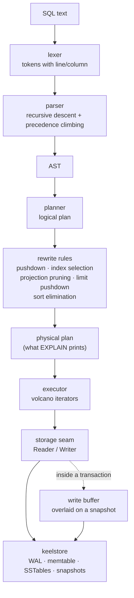

# keelsql

**A SQL query engine built on top of my own storage engine.**


keelsql is the relational half of a database. It layers a real query
pipeline — lexer, hand-written parser, logical plan, cost-lite optimiser,
volcano executor — over [**keelstore**](https://github.com/aminyx/keelstore),
the LSM-tree key/value store in the same portfolio.

**Two repositories, one database.** keelstore owns durability and ordering:
a write-ahead log, a skiplist memtable, immutable sorted files, compaction,
crash recovery, snapshots. keelsql owns everything relational: what a row
is, what a table is, how a predicate becomes a byte range, how an index is
kept in step, how a transaction's writes are held back until commit. The
interface between them is five operations — `Put`, `Get`, `Delete`,
`Snapshot` and a bounded iterator — and everything in this repository is
built on those.

```go
db, err := keelsql.Open("data", nil)
if err != nil {
        log.Fatal(err)
}
defer db.Close()

db.Exec("CREATE TABLE users (id INT PRIMARY KEY, name TEXT NOT NULL, score FLOAT)")
db.Exec("INSERT INTO users VALUES (1, 'ada', 99.5), (2, 'grace', 97.0)")

res, err := db.Exec("SELECT name FROM users WHERE id = 2")
// res.Rows[0][0] is 'grace', found by a bounded key range rather than a scan
```

---

## Why build this

Writing a storage engine teaches you about durability. Writing a query
engine teaches you about *meaning*: that `NULL = NULL` is not true, that a
`WHERE` clause is a byte range if you are lucky and a predicate if you are
not, that an index is only useful if the planner knows it exists and only
correct if every write remembers it.

keelsql is small enough to read in a sitting and complete enough to be
wrong in interesting ways if any of it were wrong:

- the key encoding is checked by a **property test** that sorts random
  encoded values as bytes and demands the decoded order match,
- the engine is checked by a **differential test** that runs three thousand
  random statements against two keelsql databases and a reference model
  written in plain Go, and demands all three agree,
- the index is checked by running every query **twice** — once through the
  index, once through a full scan — and comparing,
- concurrency is checked **under the race detector**.

---

## Contents

- [Architecture](#architecture)
- [The SQL subset](#the-sql-subset)
- [Key encoding](#key-encoding)
- [Key space](#key-space)
- [The planner](#the-planner)
- [The executor](#the-executor)
- [NULL and three-valued logic](#null-and-three-valued-logic)
- [Transactions and isolation](#transactions-and-isolation)
- [The REPL](#the-repl)
- [Verification](#verification)
- [Benchmarks](#benchmarks)
- [Testing](#testing)
- [Limitations](#limitations)
- [Future work](#future-work)
- [License](#license)

---

## Architecture



Each box is a package:

| package | what it owns |
| --- | --- |
| `lexer` | SQL text to tokens, by hand, with positions |
| `ast` | the syntax tree, and how it prints itself back as SQL |
| `parser` | tokens to AST, recursive descent, no generator |
| `types` | values, the total order over them, three-valued logic |
| `keycodec` | values to bytes, order-preserving for keys |
| `catalog` | schemas, stored in keelstore under a reserved prefix |
| `storage` | the seam to keelstore: readers, writers, the write buffer |
| `plan` | AST to logical plan to rewrite rules to physical plan |
| `exec` | physical plan to volcano operators |
| `cmd/keelsql` | the REPL |

---

## The SQL subset

```
CREATE TABLE [IF NOT EXISTS] name (col TYPE [PRIMARY KEY] [NOT NULL], ...)
DROP TABLE [IF EXISTS] name
CREATE INDEX [IF NOT EXISTS] name ON table (column)
DROP INDEX [IF EXISTS] name

INSERT INTO table [(columns)] VALUES (...), (...)
SELECT [DISTINCT] columns|* FROM table
    [WHERE expr] [GROUP BY exprs] [ORDER BY expr [ASC|DESC], ...]
    [LIMIT n] [OFFSET m]
UPDATE table SET col = expr, ... [WHERE expr]
DELETE FROM table [WHERE expr]

EXPLAIN <statement>
BEGIN | COMMIT | ROLLBACK
```

Types are `INT`, `FLOAT`, `TEXT` and `BOOL` (with the usual aliases —
`INTEGER`, `REAL`, `VARCHAR`, `BOOLEAN`). Expressions cover comparisons,
`AND`/`OR`/`NOT`, arithmetic (`+ - * / %`), `IS [NOT] NULL`,
`[NOT] BETWEEN`, `[NOT] IN (…)` and `[NOT] LIKE` with `%` and `_`.
Aggregates are `COUNT`, `SUM`, `AVG`, `MIN` and `MAX`.

Every table needs exactly one `PRIMARY KEY` column — keelsql stores a row
*under* its key, so a table without one has nowhere to put its rows.

Unquoted identifiers are folded to lower case, as in PostgreSQL; a
`"quoted"` identifier keeps its spelling. Keywords are matched
case-insensitively. Type names and aggregate names are not reserved, so a
column may still be called `count` or `text`.

### Errors point at the problem

```
keelsql: syntax error at line 1, column 10: expected FROM, found keyword WHERE
keelsql: syntax error at line 1, column 19: unknown column type "blob" (want INT, FLOAT, TEXT or BOOL)
keelsql: no such column: users.nosuch
keelsql: duplicate primary key: users.id = 1
```

---

## Key encoding

keelstore stores keys in byte order. If the encoding of a value preserves
its SQL order, then an ascending scan of encoded keys *is* an ascending
scan of values — which is what makes a primary-key range scan, a secondary
index and `ORDER BY` without a sort all possible. The property is:

> for any two values `a` and `b`,
> `bytes.Compare(Encode(a), Encode(b))` has the same sign as `Order(a, b)`.

Every encoding starts with a one-byte tag. The tags ascend in the order the
value kinds do, so values of different kinds sort by kind with NULL first.

| kind | tag | payload | example | encoded |
| --- | --- | --- | --- | --- |
| NULL | `0x00` | none | `NULL` | `00` |
| BOOL | `0x10` | 1 byte: `00` false, `01` true | `TRUE` | `10 01` |
| INT | `0x20` | 8 bytes, big-endian, **sign bit flipped** | `1` | `20 80 00 00 00 00 00 00 01` |
| FLOAT | `0x30` | 8 bytes, IEEE-754 bits, **sign-adjusted** | `1.5` | `30 bf f8 00 00 00 00 00 00` |
| TEXT | `0x40` | UTF-8, `0x00` escaped as `00 FF`, terminated by `00 01` | `'a'` | `40 61 00 01` |

### Why integers need the sign flip

Two's complement does not sort as unsigned bytes: `-1` is `FF FF … FF` and
`0` is `00 00 … 00`, so a naive encoding puts every negative number above
every positive one. Flipping the sign bit maps the signed range onto the
unsigned range monotonically:

| value | two's complement | encoded (after the flip) |
| --- | --- | --- |
| `-2` | `ff ff ff ff ff ff ff fe` | `20 7f ff ff ff ff ff ff fe` |
| `-1` | `ff ff ff ff ff ff ff ff` | `20 7f ff ff ff ff ff ff ff` |
| `0` | `00 00 00 00 00 00 00 00` | `20 80 00 00 00 00 00 00 00` |
| `1` | `00 00 00 00 00 00 00 01` | `20 80 00 00 00 00 00 00 01` |
| `300` | `00 00 00 00 00 00 01 2c` | `20 80 00 00 00 00 00 01 2c` |

Read down the last column: the bytes ascend exactly where the numbers do.

### Why floats need two rules

IEEE-754 already sorts correctly *within* the non-negative numbers, but
negatives run backwards and carry an inverted sign bit. So: for a
non-negative float, set the sign bit; for a negative float, flip every bit.

| value | encoded |
| --- | --- |
| `-1.5` | `30 40 07 ff ff ff ff ff ff` |
| `0.0` | `30 80 00 00 00 00 00 00 00` |
| `1.5` | `30 bf f8 00 00 00 00 00 00` |

### Why strings need escaping

A plain byte comparison of UTF-8 is already lexicographic by code point, so
the only problem is knowing where a string ends — without a terminator,
`'a'` followed by a primary key would be indistinguishable from `'ab'`
followed by a shorter one. A bare `0x00` terminator would break for strings
that contain `0x00`, so:

- a literal `0x00` inside the string becomes `00 FF`,
- the string ends with `00 01`.

Since `0x01 < 0xFF`, both orderings come out right:

| value | encoded | sorts |
| --- | --- | --- |
| `''` | `40 00 01` | first |
| `'a'` | `40 61 00 01` | before `'a\0b'` — `01` < `FF` |
| `'a\0b'` | `40 61 00 ff 62 00 01` | before `'ab'` — `00` < `62` |
| `'ab'` | `40 61 62 00 01` | last |

Because every encoding is self-delimiting, encodings concatenate: an index
entry is the indexed value followed by the primary key, and the result
still sorts field by field.

`TestOrderPreservationProperty` generates random values across every kind,
sorts the encodings as raw bytes, sorts the values by `types.Order`, and
demands the two agree — two hundred rounds of sixty values, including
`MinInt64`, infinities, embedded NUL bytes and empty strings.

### Rows

A stored row is a format byte followed by every column value in declaration
order, using the same self-delimiting encoding:

```
row (1, 'ada', NULL) → 01 | 20 80 00 00 00 00 00 00 01 | 40 61 64 61 00 01 | 00
                       ^      ^                          ^                   ^
                       format INT 1                      TEXT 'ada'          NULL
```

Because fields are self-delimiting, the decoder can *skip* a field instead
of building it. That is what makes projection pruning worth doing: a query
that reads two columns of a ten-column table walks past the other eight
without allocating them.

---

## Key space

Everything — catalog, rows and index entries — lives in one flat keelstore
key space, partitioned by a leading prefix byte:

| key | meaning |
| --- | --- |
| `01 74 <name>` | catalog entry for table `<name>`, JSON |
| `01 73` | the identifier counter |
| `02 <table:4> <pk>` | a row |
| `03 <table:4> <index:4> <value> <pk>` | a secondary index entry |

Identifiers are big-endian, so one table's rows occupy one contiguous byte
range — which is what turns "scan table `t`" into a bounded iteration
rather than a walk over the whole store.

```
data prefix, table 7          02 00 00 00 07
row key, table 7, pk 1        02 00 00 00 07 20 80 00 00 00 00 00 00 01
index key, table 7, index 2   03 00 00 00 07 00 00 00 02 40 61 64 61 00 01 20 80 00 00 00 00 00 00 01
                              |  table       index       'ada'            pk 1
```

The indexed value comes before the primary key, so entries sort by that
value; the primary key is appended to keep entries unique when the value
repeats and so the row can be fetched with a single `Get`. Every row gets
an entry in every index, NULLs included, so an unbounded index scan sees
exactly what a table scan sees.

The catalog is JSON, on purpose: it is small, it is read once at open, and
being able to look at it with `strings` is worth more than the bytes it
costs.

---

## The planner

The logical plan is the shape SQL implies — scan, filter, group, sort,
project, cut off. Rules then rewrite it into something cheaper:

1. **Predicate pushdown.** `WHERE` is split into conjuncts. Any conjunct
   comparing an indexed or primary-key column against a constant becomes a
   bound; bounds on the same column intersect into one range. A predicate a
   scan absorbs disappears from the filter above it.
2. **Index selection.** Candidate access paths are priced under a cost-lite
   model — a fixed row estimate and fixed selectivity guesses, no
   histograms — and the cheapest wins. A primary-key range beats a
   secondary index of the same width, because it needs no second fetch.
3. **Projection pruning.** The scan is told which columns the query
   actually reads, and the row decoder skips the rest.
4. **Limit pushdown.** `ORDER BY … LIMIT n` becomes a top-N sort with a
   bounded heap of `n + offset` rows instead of a full sort.
5. **Sort elimination.** A scan already returns rows ordered by whatever it
   walks, so an `ORDER BY` asking for exactly that is free.

### Before and after, for real

Without an index, a predicate on `city` has to be checked row by row:

```
keelsql> SELECT name FROM users WHERE city = 'berlin';
Project columns=[name]
  -> Filter predicate=city = 'berlin'
    -> SeqScan table=users columns=[name, city]
```

Add one, and the same query becomes a bounded walk of a byte range. Note
that the `Filter` is gone — the scan absorbed the predicate — and that
`city` has dropped out of `columns`, because nothing reads it any more:

```
keelsql> CREATE INDEX idx_city ON users (city);
keelsql> SELECT name FROM users WHERE city = 'berlin';
Project columns=[name]
  -> IndexScan table=users index=idx_city on=city range=['berlin', 'berlin'] columns=[name]
```

A predicate on the primary key needs no index at all, and `ORDER BY id`
costs nothing because the scan already walks the key in order — there is no
`Sort` node:

```
keelsql> SELECT name FROM users WHERE id BETWEEN 2 AND 4 ORDER BY id LIMIT 2;
Limit count=2 offset=0
  -> Project columns=[name]
    -> RangeScan table=users pk=id range=[2, 4] columns=[name]
```

Everything at once — a pushed range, a residual filter, a top-N sort and a
limit:

```
EXPLAIN SELECT name, score FROM t
        WHERE id BETWEEN 10 AND 20 AND score > 1.0
        ORDER BY score DESC LIMIT 2 OFFSET 1;

Limit count=2 offset=1
  -> Project columns=[name, score]
    -> Sort keys=[score DESC] mode=top-3
      -> Filter predicate=score > 1.0
        -> RangeScan table=t pk=id range=[10, 20] columns=[name, score]
```

### One rule that exists for correctness, not speed

A bound is only pushed down when the constant's kind matches the column's.
`WHERE int_column > 1.5` is perfectly legal SQL and must keep working, but
a `FLOAT` bound encodes with tag `0x30` while every `INT` encodes with tag
`0x20`, so a byte range built from it would start past every row in the
table and silently return nothing. The predicate stays in the filter, where
numeric comparison handles it properly. `WHERE col = NULL` is left alone
for the same reason: it is UNKNOWN for every row, which a range cannot
express and a filter can.

---

## The executor

The volcano iterator model: every operator exposes

```go
Next() (Row, bool, error)
```

and pulls from its input when it needs another row. A scan, a filter, a
projection and a limit stream one row at a time; only the sort, the
aggregation and `DISTINCT` buffer anything.

| operator | notes |
| --- | --- |
| `SeqScan` | every row of a table, in primary-key order |
| `RangeScan` | a contiguous slice of the primary-key space |
| `IndexScan` | walks an index range, fetches each row by key |
| `Filter` | keeps rows whose predicate is TRUE — not FALSE, not UNKNOWN |
| `Project` | evaluates the SELECT list |
| `Sort` | in memory; a bounded heap when a limit was pushed into it |
| `Limit` | count and offset |
| `Distinct` | deduplicates by the order-preserving encoding of the row |
| `HashAggregate` | `COUNT`/`SUM`/`AVG`/`MIN`/`MAX`, with or without `GROUP BY` |

The sort is **in memory**. keelsql does not spill to disk, so a query that
orders more rows than fit in memory will not finish. That is the honest
limitation of a small engine, and it is why the limit is pushed into the
sort whenever it can be. The operator is written so that adding a spill
would be a change to one function.

Group keys are the order-preserving encoding of the group values, so
sorting the keys as byte strings sorts the groups by value — grouped output
is deterministic without a separate sort. An ungrouped aggregation always
produces exactly one row, so `SELECT COUNT(*) FROM empty` returns `0`
rather than nothing.

---

## NULL and three-valued logic

SQL's `WHERE` is not boolean. A comparison against NULL is UNKNOWN, and a
row is kept only when its condition is TRUE — FALSE and UNKNOWN are both
discarded, which is why `WHERE c <> 1` does not return the rows whose `c`
is NULL.

keelsql implements Kleene's three-valued logic with the constants ordered
`FALSE < UNKNOWN < TRUE`, which makes `AND` the minimum, `OR` the maximum
and `NOT` the reflection — so the implementation cannot disagree with the
truth tables:

```
 AND | F  U  T          OR | F  U  T          NOT
 ----+---------        ----+---------        ---------
  F  | F  F  F          F  | F  U  T          F  ->  T
  U  | F  U  U          U  | U  U  T          U  ->  U
  T  | F  U  T          T  | T  T  T          T  ->  F
```

The consequences, all pinned by tests:

```sql
SELECT id FROM t WHERE c = NULL;             -- no rows, ever
SELECT id FROM t WHERE NULL = NULL;          -- no rows, ever
SELECT id FROM t WHERE c <> 1;               -- skips rows whose c is NULL
SELECT id FROM t WHERE NOT (c = 1);          -- same: NOT UNKNOWN is UNKNOWN
SELECT id FROM t WHERE c IS NULL;            -- the only way to ask
SELECT id FROM t WHERE c IN (1, NULL);       -- matches 1; otherwise UNKNOWN
SELECT id FROM t WHERE c NOT IN (1, NULL);   -- no rows, ever
```

Two places deliberately use a *total* order instead, where NULL equals
NULL: `GROUP BY` puts all the NULLs in one group, and `DISTINCT` collapses
them to one row. `ORDER BY` sorts NULLs first ascending, last descending.
Aggregates ignore NULL inputs, so `AVG(c)` divides by the number of values
present, not by the number of rows; `SUM` of nothing is NULL, not zero.

---

## Transactions and isolation

```sql
BEGIN;
UPDATE accounts SET balance = balance - 100 WHERE id = 1;
UPDATE accounts SET balance = balance + 100 WHERE id = 2;
COMMIT;
```

A transaction is a keelstore snapshot plus an in-memory write buffer. Reads
go through an overlay: the buffer first, the snapshot underneath, merged in
key order — so a statement sees its own uncommitted writes while everything
else stays exactly as it was when the transaction began. `ROLLBACK` drops
the buffer; nothing was written, so there is nothing to undo.

**The isolation level is snapshot isolation without write-write conflict
detection.** Being precise about what that does and does not give you:

- ✅ Reads are stable. A transaction never sees a value change underneath
  it, however many other transactions commit while it runs.
- ✅ Readers never block writers and writers never block readers.
- ✅ A commit is atomic with respect to other keelsql readers in the same
  process: a snapshot cannot be taken while a write set is being applied.
- ❌ **Last writer wins.** If two transactions read the same row and both
  update it, the second commit silently overwrites the first. Neither is
  told. This is weaker than serializable, and weaker than the snapshot
  isolation of a database that aborts on conflict.
- ❌ Not crash-atomic. keelstore exposes single-key writes and no batch
  primitive, so a commit is a sequence of writes; a process that dies
  part-way through leaves part of the write set behind.
- ❌ Schema changes are not transactional. `CREATE TABLE` and friends
  update the in-memory catalog as well as the store, so keelsql refuses
  them inside an explicit transaction rather than pretending they can be
  rolled back.

A statement outside an explicit transaction runs inside an implicit one, so
a multi-row `INSERT` that hits a duplicate key half way through commits
none of its rows.

---

## The REPL

```
go build -o bin/keelsql ./cmd/keelsql
./bin/keelsql -db mydata
```

`-c "SQL"` runs a script and exits; otherwise statements are read from
standard input until end of input. Statements end with a semicolon and may
span lines. `-echo` prints the input after the prompt, which is how the
transcript below was captured from a pipe.

Dot commands: `.tables`, `.schema [table]`, `.explain on|off`,
`.timer on|off`, `.help`, `.quit`.

### A real session

Produced by `./keelsql -db demo.db -echo`, pasted unedited:

```
keelsql 0.1.0 — a SQL engine on keelstore
database demo.db; .help for commands, .quit to leave

keelsql> CREATE TABLE users (id INT PRIMARY KEY, name TEXT NOT NULL, city TEXT, score FLOAT);
-- CREATE TABLE (0.177ms)
keelsql> INSERT INTO users VALUES
    ...>   (3, 'carol', 'berlin',   71.5),
    ...>   (1, 'ada',   'london',   99.5),
    ...>   (4, 'dan',   'berlin',   NULL),
    ...>   (2, 'grace', 'new york', 97.0),
    ...>   (5, 'erin',  'london',   64.0);
-- INSERT 5 (0.064ms)
keelsql> .tables
users
keelsql> .schema users
CREATE TABLE users (
  id INT PRIMARY KEY,
  name TEXT NOT NULL,
  city TEXT,
  score FLOAT
);
keelsql> SELECT * FROM users;
+----+-------+----------+-------+
| id | name  | city     | score |
+----+-------+----------+-------+
| 1  | ada   | london   | 99.5  |
| 2  | grace | new york | 97.0  |
| 3  | carol | berlin   | 71.5  |
| 4  | dan   | berlin   | NULL  |
| 5  | erin  | london   | 64.0  |
+----+-------+----------+-------+
-- 5 rows (0.020ms)
keelsql> SELECT name, score FROM users WHERE score > 70.0 ORDER BY score DESC;
+-------+-------+
| name  | score |
+-------+-------+
| ada   | 99.5  |
| grace | 97.0  |
| carol | 71.5  |
+-------+-------+
-- 3 rows (0.056ms)
keelsql> SELECT city, COUNT(*), AVG(score) FROM users GROUP BY city;
+----------+----------+------------+
| city     | COUNT(*) | AVG(score) |
+----------+----------+------------+
| berlin   | 2        | 71.5       |
| london   | 2        | 81.75      |
| new york | 1        | 97.0       |
+----------+----------+------------+
-- 3 rows (0.058ms)
keelsql> SELECT id, name FROM users WHERE score IS NULL;
+----+------+
| id | name |
+----+------+
| 4  | dan  |
+----+------+
-- 1 row (0.010ms)
keelsql> .explain on
-- explain on
keelsql> SELECT name FROM users WHERE city = 'berlin';
Project columns=[name]
  -> Filter predicate=city = 'berlin'
    -> SeqScan table=users columns=[name, city]
+-------+
| name  |
+-------+
| carol |
| dan   |
+-------+
-- 2 rows (0.046ms)
keelsql> CREATE INDEX idx_city ON users (city);
-- CREATE INDEX (0.081ms)
keelsql> SELECT name FROM users WHERE city = 'berlin';
Project columns=[name]
  -> IndexScan table=users index=idx_city on=city range=['berlin', 'berlin'] columns=[name]
+-------+
| name  |
+-------+
| carol |
| dan   |
+-------+
-- 2 rows (0.016ms)
keelsql> SELECT name FROM users WHERE id BETWEEN 2 AND 4 ORDER BY id LIMIT 2;
Limit count=2 offset=0
  -> Project columns=[name]
    -> RangeScan table=users pk=id range=[2, 4] columns=[name]
+-------+
| name  |
+-------+
| grace |
| carol |
+-------+
-- 2 rows (0.011ms)
keelsql> .explain off
-- explain off
keelsql> BEGIN;
-- BEGIN (0.001ms)
keelsql> DELETE FROM users WHERE city = 'london';
-- DELETE 2 (0.016ms)
keelsql> SELECT COUNT(*) FROM users;
+----------+
| COUNT(*) |
+----------+
| 3        |
+----------+
-- 1 row (0.015ms)
keelsql> ROLLBACK;
-- ROLLBACK (0.001ms)
keelsql> SELECT COUNT(*) FROM users;
+----------+
| COUNT(*) |
+----------+
| 5        |
+----------+
-- 1 row (0.036ms)
keelsql> .quit
```

The timings come from Go's monotonic clock. On some Windows builds its
resolution is about half a millisecond, so sub-millisecond statements
report `0.000ms` there; the session above was captured on Linux, where the
resolution is fine enough to be useful.

---

## Verification

There is **no CI in this repository** — no `.github` directory, no
workflows, no badge pretending otherwise. `make check` is the gate, and the
committed `.githooks/pre-commit` hook runs it before every commit:

```
make hooks      # git config core.hooksPath .githooks
```

The output below is `make check` inside the same pinned image the race target
uses, so anyone can reproduce it on any machine with Docker — the real
Makefile, the real targets, unedited output:

```
$ docker run --rm -v "$PWD:/app" -w /app golang:1.25 make check
==> gofmt
    clean
==> go vet
    clean
==> lint
    staticcheck not installed, skipping (go vet already ran)
==> go test
ok  	github.com/aminyx/keelsql	1.069s
ok  	github.com/aminyx/keelsql/ast	0.018s
ok  	github.com/aminyx/keelsql/catalog	0.020s
?   	github.com/aminyx/keelsql/cmd/keelsql	[no test files]
ok  	github.com/aminyx/keelsql/exec	0.032s
ok  	github.com/aminyx/keelsql/keycodec	0.043s
ok  	github.com/aminyx/keelsql/lexer	0.022s
ok  	github.com/aminyx/keelsql/parser	0.020s
ok  	github.com/aminyx/keelsql/plan	0.038s
ok  	github.com/aminyx/keelsql/storage	0.019s
ok  	github.com/aminyx/keelsql/types	0.014s
==> go build
    bin/keelsql
==> benchmark smoke test
    all benchmarks ran
==> check: all clear
```

The race detector needs a C toolchain, which a Windows development box
usually does not have. `make race` runs the suite inside a pinned Docker
image instead of skipping the check:

The target is one `docker run`, and this is that command and its output:

```
$ docker run --rm -v "$PWD:/app" -w /app golang:1.25 go test -race ./...
ok  	github.com/aminyx/keelsql	18.131s
ok  	github.com/aminyx/keelsql/ast	1.069s
ok  	github.com/aminyx/keelsql/catalog	1.084s
?   	github.com/aminyx/keelsql/cmd/keelsql	[no test files]
ok  	github.com/aminyx/keelsql/exec	1.290s
ok  	github.com/aminyx/keelsql/keycodec	1.452s
ok  	github.com/aminyx/keelsql/lexer	1.164s
ok  	github.com/aminyx/keelsql/parser	1.243s
ok  	github.com/aminyx/keelsql/plan	1.077s
ok  	github.com/aminyx/keelsql/storage	1.037s
ok  	github.com/aminyx/keelsql/types	1.049s
```

Other targets: `make fmt`, `make cover`, `make bench`, `make short`,
`make repl`, `make clean`, `make help`.

---

## Benchmarks

`make bench`, on a table of 5000 rows, Go 1.25, linux/amd64, i5-8300H:

```
BenchmarkInsert-8           	  220526	     12557 ns/op	    2335 B/op	      45 allocs/op
BenchmarkPointLookup-8      	  152070	     13969 ns/op	    3073 B/op	      65 allocs/op
BenchmarkIndexLookup-8      	   17169	    151316 ns/op	   20209 B/op	     364 allocs/op
BenchmarkFullScanLookup-8   	     468	   4427797 ns/op	  651139 B/op	    5164 allocs/op
BenchmarkRangeScan-8        	   28598	     83307 ns/op	   40557 B/op	     481 allocs/op
BenchmarkFullScan-8         	    1929	   1340461 ns/op	  643084 B/op	    5067 allocs/op
BenchmarkGroupBy-8          	     612	   6214135 ns/op	 1161145 B/op	   26009 allocs/op
BenchmarkTopNSort-8         	     836	   4770987 ns/op	  887275 B/op	   10102 allocs/op
BenchmarkParse-8            	  678200	      4388 ns/op	     992 B/op	      26 allocs/op

BenchmarkEncodeRow-8        	11710267	       190.5 ns/op	       0 B/op	       0 allocs/op
BenchmarkDecodeRow-8        	 8058061	       319.9 ns/op	     320 B/op	       3 allocs/op
BenchmarkDecodeRowMasked-8  	14356568	       335.5 ns/op	     208 B/op	       1 allocs/op
BenchmarkEncodeKey-8        	166188736	        15.54 ns/op	       0 B/op	       0 allocs/op
```

The two numbers worth reading together are `IndexLookup` and
`FullScanLookup`: the same query — `SELECT id FROM bench WHERE k = ?`,
matching about 50 of 5000 rows — answered through an index and through a
full scan. **151 µs against 4.43 ms, a factor of 29**, and 20 KB of
allocation against 651 KB. That is the planner's whole job in one pair of
lines.

`DecodeRowMasked` is the honest one: skipping four of five fields saves
*allocations* (1 instead of 3, 208 B instead of 320 B) but not wall-clock
time on a row this small, because the cost is dominated by building the
output slice. It pays off on wide rows with long strings, which is where
projection pruning matters and where a microbenchmark of a five-column row
does not show it.

---

## Testing

171 test functions and 13 benchmarks. Everything runs offline, with no
fixtures and no network.

**The property test.** `TestOrderPreservationProperty` generates random
values across every kind — including `MinInt64`, `MaxInt64`, infinities,
negative zero, embedded NUL bytes and empty strings — encodes them, sorts
the encodings as raw bytes, sorts the values by the logical order, and
demands the two sequences match. It is the test that caught a real
disagreement during development: `types.Order` originally compared an INT
against a FLOAT numerically, which no byte encoding can reproduce, and the
fix was to make the ordering kind-first and say so in the documentation.

**The differential test.** `TestDifferentialAgainstAReferenceImplementation`
runs 3000 random statements against three implementations at once:

1. a keelsql database with a secondary index on `k`,
2. a keelsql database without one,
3. a reference model in plain Go — a map of rows, nullable columns as
   pointers, and a three-valued predicate evaluator written independently
   of `types.Bool3` so that it cannot inherit the bug it is meant to catch.

Every `INSERT`, `UPDATE`, `DELETE` and `SELECT` is applied to all three.
The model is the oracle for *what* the answer is; the second database is
the oracle for the *index*, because a query the planner answers through an
index in one database is answered by a full scan in the other. An index
entry that was not maintained shows up immediately as two engines
disagreeing while sharing every other line of code. A companion test does
the same for `ROLLBACK`, checking that both the rows and the index come
back to where they started.

**What else is pinned:** the lexer's escapes, numbers and rune-accurate
columns; every statement form through the parser, plus twenty-six precise
error messages checked for text *and* position; catalog persistence across
a reopen, including the identifier counter; the three-valued truth tables
in full; each planner rule with a before-and-after `EXPLAIN`; every
operator in isolation and composed by hand; aggregation over NULLs and over
nothing; the Halloween problem (an `UPDATE` that moves rows forward must
not visit them twice); snapshot stability while another session commits;
and concurrent readers and writers under `-race`.

---

## Limitations

The subset is real, and so is what is missing.

- **No joins.** One table per query. There is no nested-loop join, no hash
  join and no merge join — the executor has no binary operator at all. Of
  the three, a nested-loop join over the primary-key index is the one that
  would fit the current design without changing anything else.
- **No subqueries**, correlated or otherwise; no `UNION`, no CTEs, no
  views, no window functions.
- **No `HAVING`.** Filter before the grouping, not after it.
- **No `ALTER TABLE`.** Tables are created and dropped.
- **Single-column indexes only.** No composite indexes, no partial indexes,
  no unique indexes other than the primary key, and no index-only scans:
  an index scan always fetches the row even when the index holds every
  column the query wants.
- **The sort is in memory.** No external merge, no spill to disk.
- **`ORDER BY … DESC` cannot use a scan's ordering**, because keelstore's
  iterator is forward-only; a descending order always costs a sort.
- **`ORDER BY` cannot reference a SELECT alias**, only table columns,
  expressions over them, or — in a grouped query — the group keys and
  aggregate calls as written.
- **`IN (…)` is not pushed down**, even on the primary key, where it could
  become a union of point lookups.
- **The cost model has no statistics.** No row counts, no histograms, no
  `ANALYZE`: selectivity is a fixed guess per predicate shape. The guesses
  are ordered correctly, which is enough to choose between the access paths
  keelsql has, and would not be enough for a join.
- **Isolation is snapshot isolation without conflict detection**, and
  commit is not crash-atomic. See [above](#transactions-and-isolation).
- **One process.** keelstore is an embedded store with no cross-process
  locking, so exactly one process may open a database at a time.
- **No prepared statements or parameters.** Every query is parsed from
  text, which also means keelsql has nothing to say about SQL injection —
  do not build queries from untrusted input.

---

## Future work

In the order they would earn their place:

1. **A nested-loop join**, driven by the primary-key index on the inner
   side. It is the smallest change that makes the engine relational rather
   than tabular.
2. **Index-only scans.** The index entry already carries the indexed value
   and the primary key; a query that wants nothing else should never touch
   the row.
3. **Composite and unique indexes.** The encoding already concatenates,
   so the storage work is done; the planner needs prefix matching.
4. **An external merge sort**, so that ordering a large table stops being a
   memory question.
5. **Write-write conflict detection**, turning last-writer-wins into real
   snapshot isolation by tracking the write set and refusing a commit whose
   keys changed since the snapshot.
6. **A batch write primitive in keelstore**, which would make commit
   crash-atomic and let the two projects meet in the middle.
7. **Statistics.** Even a row count per table would let the cost model say
   something true.

---

## License

MIT. See [LICENSE](LICENSE).

---

**See also:** [keelstore](https://github.com/aminyx/keelstore) — the
LSM-tree storage engine underneath this one.
